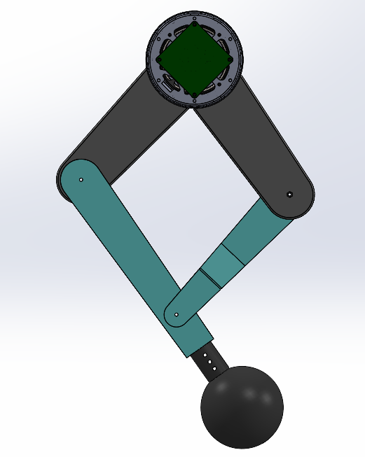
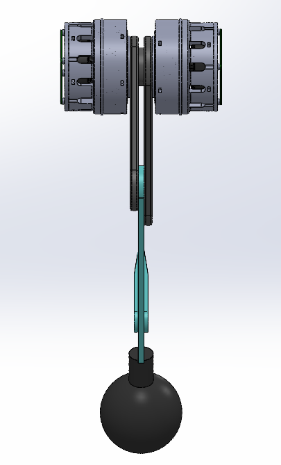
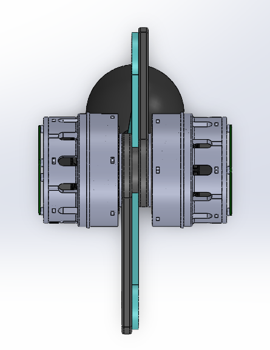

# TITANLEG DESIGN EKLAVYA 2023

## About the Project
This project aims towards the design and the development of the robotic legs, and testing the same against the environmental constraints(different terrains), the Torque bearing capacity, the load as well as the shock bearing capabilities of the legs of a Quadruped Robot. So basically designing, manufacturing, testing, and controlling of leg for a quadruped is to be done in this Project.  

##  **What** is **a** **Quadruped** **Robot** **?**
**Normally**, wheels are used for the motion of any bot.But in a Quadruped bot,we use robotic legs for the motion of the bot. A Quadruped Robot is a robot, and as the name says, it has 4 legs to help the robot perform various gait activities and ultimately help the bot achieve translational or rotational motion of the Robot.  
   Quadruped robots have a better stability towards any kind of terrain and are more robust as compared to the typical wheeled robots. The legs of the robot provide us a greater stability even on uneven surfaces and they also have capability of restanding after toppling. They are highly energy efficient and versatile. There are a lot many advantages of the Quadruped Robots, like high load capacity, Payload capacity, and also there is a wide range of its applications, like in construction, delivery and transport, industrial inspections, Military & Defense, exploration etc..

### This is the Drive link for my [Notes](https://drive.google.com/drive/folders/1BKAqDc1qUA2TaJVheQEBdqIbFcL9Njp0)

## The Flow of the project :

First the basic concepts of the project needs to be cleared. Quadrupped is advantageous, but how can we approach and make it? What are the pre-preparation for the same?  
 We just need to undergo the previous research papers on the Quadraped Robots, have a basic understanding of the mechanisms we need to drive the upper and lower leg links, get abbduction as well as adduction , have a basic knowledge of materials ,the Leg modelling and simulations as well.
 Then comes the manufacture part and the various tests (No worries, will cover up section by section and level up). 

 ## Study of the Quadrupped Bots and the Research we did :
Let's start from start. We had a rough idea about the Quadrupped Robots, their working, advantages, applications ...blah blah. But this wasn't just enough to design a leg on which the bot would completely rely.There are many factors on which the stability margin of our bot depends, for eg. the material used, the gears reduction, the materials....and this goes on. Just imagine yourself while walking, your smooth locomotion depends on the factors like your hip joint and knee joint , your leg links ; similar is for the Quadrupeds.  
     It was really a challenging task then to get our concepts stronger, our imagination wider and maike the bot's eg stronger. And knowing htis all we then started with the study. We picked the research papers of some of the very famous Quadrupeds like [MIT Cheetah](https://news.mit.edu/2019/mit-mini-cheetah-first-four-legged-robot-to-backflip-0304), [IISc Stoch](https://eprints.iisc.ac.in/77543/1/ICCAR_2019.pdf), [ANYmal](https://www.youtube.com/watch?app=desktop&v=P6y_dhFTgik) and then after having a good study of the locomotion system & power transmission system of these, we started the our leg's rough paper sketches.
### ANYmal : 

  
### MIT Cheetah :

  
### Stoch :

We initially made 3 designs : 
1. One having a linear actuator on its upper ink to drive the lower link
2. Second where there is a belt pulley system attached to the upperlink so as to drive the lower link
3. Third where we have a Pentograph mechanism to drive the upper and lower links simultaneously as when and wherever required.

This way we got 3 designs ready for our Quadruped Titan. 
  We got these designs with their dimensions and then startec implementing them in [SOLIDWORKS](https://www.solidworks.com/). We also used [FUSION360](https://www.autodesk.com/solutions/what-is-fusion-360) whenever required. 
    Getting started with the Pentograph mechanism in Solid Works, basically, a Pentograph or scissor lift, is a type of platform which moves vertically rather than horizontally. It uses linked, folding supports in a criss-cross pattern.

Finally after spending almost a week on the designing part, we finally got 2 designs completed simultaneously.

### THE DESIGN USING PENTOGRAPH MECHANISM : 
FORNT VIEW : 

RH SIDE VIEW : 

TOP VIEW :

